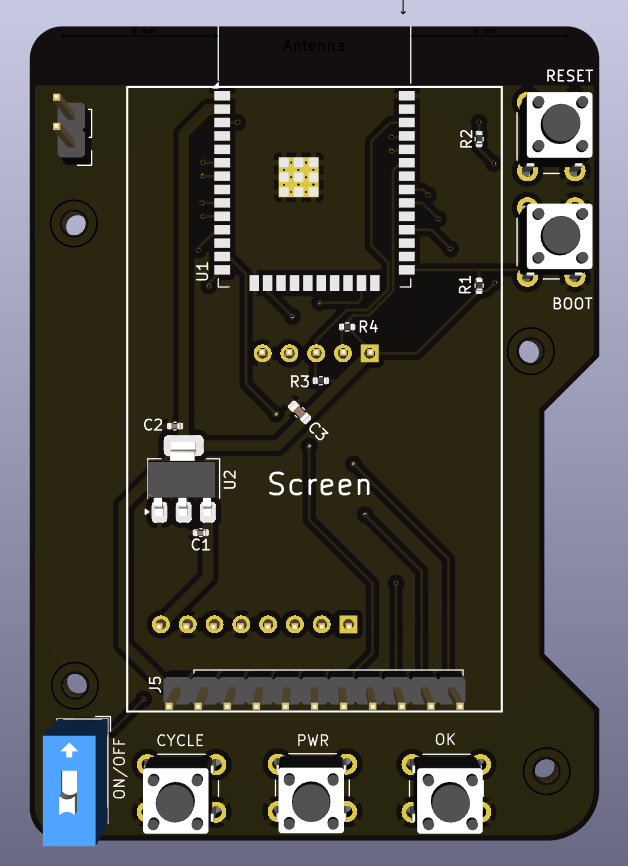
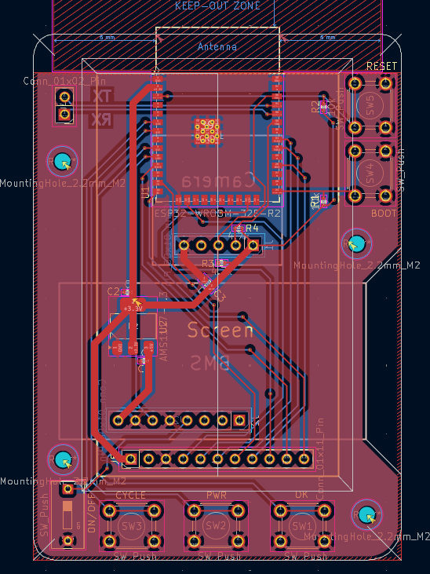
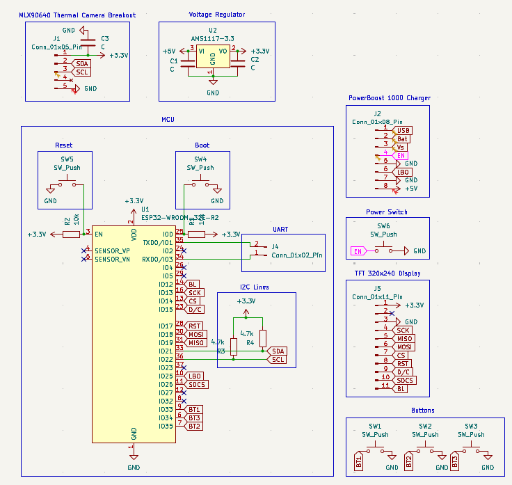

## Total time: -

---

# July 25th: Started researching

Started looking for thermal cameras that fit in the budget and an MCU that could do some simple overlay GUI on the display

Datasheets and stuff:

- $66.50 - [Melexis MLX90640](https://cdn.sparkfun.com/assets/7/b/f/2/d/MLX90640-Datasheet-Melexis.pdf)
- $6.29 - [ESP32-WROOM-32E-N8R2](https://www.espressif.com/sites/default/files/documentation/esp32-wroom-32e_esp32-wroom-32ue_datasheet_en.pdf)
- $19.95 - [PowerBoost 1000 Charger](https://learn.adafruit.com/adafruit-powerboost-1000c-load-share-usb-charge-boost/downloads)
- $19.95 - [2.0" 320x240 Color IPS TFT Display](https://learn.adafruit.com/2-0-inch-320-x-240-color-ips-tft-display/pinouts)

**Total time spent: 4h**

---

# July 25th pt2: Kicad go brrrr

> Copious amounts of rewiring and having to remake the PCB twice because it looked horrible later...

It looks... well... decent :sob:

The vision is there just not sure if it will turn out looking like a melted box :pf:

**Total time spent: 5h**

---

# July 25th pt3: Schematic looks less bad now

Cleaned up the schematic and made it look less like a horrible mess and more like an actual schematic :D

~~i don't even know what rev this is :sob:~~

**Total time spent: 1h**
