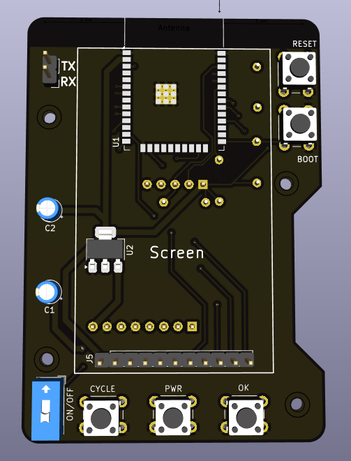

## Total time: 21 hours

---

# July 24th: Started researching

Started looking for thermal cameras that fit in the budget and an MCU that could do some simple overlay GUI on the display

Datasheets and stuff:

- $66.50 - [Melexis MLX90640](https://cdn.sparkfun.com/assets/7/b/f/2/d/MLX90640-Datasheet-Melexis.pdf)
- $6.29 - [ESP32-WROOM-32E-N8R2](https://www.espressif.com/sites/default/files/documentation/esp32-wroom-32e_esp32-wroom-32ue_datasheet_en.pdf)
- $19.95 - [PowerBoost 1000 Charger](https://learn.adafruit.com/adafruit-powerboost-1000c-load-share-usb-charge-boost/downloads)
- $19.95 - [2.0" 320x240 Color IPS TFT Display](https://learn.adafruit.com/2-0-inch-320-x-240-color-ips-tft-display/pinouts)

**Total time spent: 4h**

---

# July 24th pt2: Kicad go brrrr

> Copious amounts of rewiring and having to remake the PCB twice because it looked horrible later...

It looks... well... decent :sob:

The vision is there just not sure if it will turn out looking like a melted box :pf:

**Total time spent: 5h**

---

# July 24th pt3: Schematic looks less bad now

Cleaned up the schematic and made it look less like a horrible mess and more like an actual schematic :D

~~i don't even know what rev this is :sob:~~

**Total time spent: 1h**

---

# July 25th: CADDDDDD (i suck at 3D modeling)

> Yes, thats Commic Sans

Made the case and it's now looking less bad :sob:

Has some pins to align the PCB and fix it in place and supports that _should_ make it sturdier

The headers have holes so i can tap into them while the case is assembled, it doesn't look the best but should help with debugging/making the software

Sadly the only model that existed was for the screen so i made the tolerances for the charger and camera less tight so the yactually fit

**Total time spent: 3h**

---

# July 25th p2: My brain isn't working

Remembered that parts don't stick together with magic so i made some adjustments for parts to snap to the correct place

Also adjusted some tolerances to avoid having to sand stuff down

**Total time spent: 2h**

---

# July 25th p3: BOM stuff

Some more BOM calculations:

- $19.95 - [2.0" 320x240 Color IPS TFT Display](https://www.adafruit.com/product/4311)
- $66.50 - [MLX90640 Thermal Camera Breakout](https://shop.pimoroni.com/products/mlx90640-thermal-camera-breakout?variant=12536948654163)
- $19.95 - [PowerBoost 1000 Charger](https://www.adafruit.com/product/2465)
- $xxxx - PCB

**Total time spent: 1h**

---

# July 25th p4: BOM stuff

Swapped out the resistors and capacitors for THT variants to save on cost and changed some routing

**Total time spent: 1h**

---

# July 25th p5: Sad times

I was using the wrong ESP32 and the version with PSRAM (what i need) is out of stock everywhere so ill have to swap it out to the S3 which has a completely different footprint AAAAAAAAAAAAAA

Had to do a full rewire D:

Kept everything in the same spot to avoid having to redo the CAD :sob:

**Total time spent: 3h**

---

# July 25th p6: Checking prices

Calculated the prices at checkout and arrived at this:

- $6.16 - PCB
- $17.19 - Components

**Total time spent: 1h**
