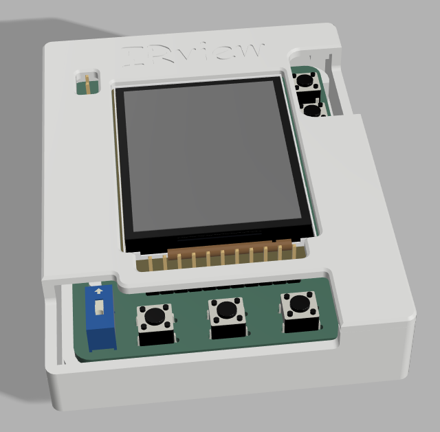
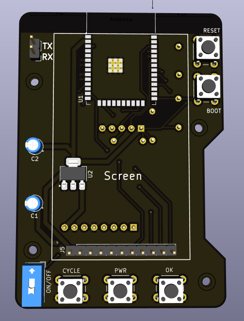
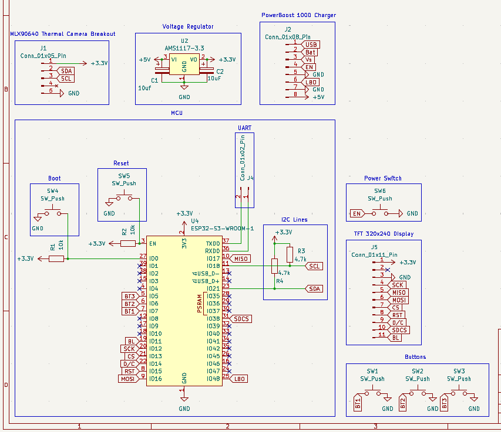

# IRview

A tiny thermal camera with a screen. It's powered by an  ESP32-S3-WROOM-1 with 8mb of PSRAM and 8mb of RAM and uses a Melexis far infrared thermal sensor array with a 32x24 resolution that can measure temperatures from -40 to 300°C and has a 55° FOV and uses a PowerBoost 1000 as a BMS that enables it to use a LiPO battery.

The 320x240px screen at the front is used to display the image data, battery and temperature readings and the buttons are used to switch modes. All pin headers are exposed, even when the case is assembled, to help with debugging. It does not include an usb to UART chip so programming must be done using the exposed TX/RX pins with an external programmer.

---

## Why

Thermal cameras are very expensive and have always felt like magic to me so why not try to make my own on a budget (while also finding out that IR sensors are way more expensive than i expected and that AliExpress always saves the day) :D

---

---

## PCB

---

## Schematic

---

## BOM

| Part      | Qty | Price (USD) | Link |
| --------- | :-: | :---------: | ---- |
|  MLX90640 |  1  | 26.93 - V | https://www.aliexpress.us/item/1005008180135795.html |
| PowerBoost 1000 Charger |  1  | 12.17 - V | https://www.aliexpress.com/item/1005009316907106.html |
| 2.0" 320x240 Color IPS TFT Display |  1  | 7.40 - (54.77 vendor total) | https://www.adafruit.com/product/4311 |
| ESP32-S3-WROOM-1-N8R8 |  2  | 11.03 - V | https://lcsc.com/product-detail/WiFi-Modules_ESPRESSIF-ESP32-S3-WROOM-1-N8R8_C2913201.html |
| AMS1117-3.3 |  5  | 0.87 - (22.78 vendor total) | https://lcsc.com/product-detail/Voltage-Regulators-Linear-Low-Drop-Out-LDO-Regulators_Advanced-Monolithic-Systems-AMS1117-3-3_C6186.html |
| PCB |  1  | 6.16 | - |
| **Total** |     |  **84** |      |

(All total vendor prices include shipping and the down arrow represents merged prices in a single order)

(This BOM does not account for the buttons/headers as i already have those)
